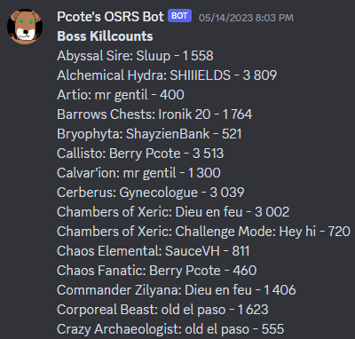
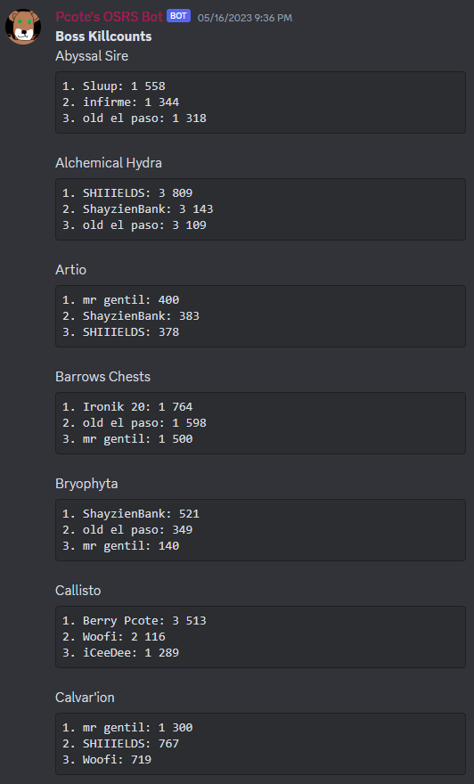

# Pcote's Discord Bot
**A Discord bot with some utilities.**

## Features

**Display on a Discord channel a KC leaderboard from a WOM group.**
* Top 1 leaderboard

* Top X leaderboard


## Installation
[Install Python](https://www.python.org/downloads/)

Install PIP
```
curl https://bootstrap.pypa.io/get-pip.py -o get-pip.py
python get-pip.py
del get-pip.py
```

Install the necessary packages 
```
pip install -r requirements.txt
```

## Configuration

A **config.json** file should be created in the root folder with the following content filled properly.
```JSON
{
    "BOT_DESCRIPTION": "",
    "DATABASE": false,
    "BOT_PREFIX": "!",
    "HISCORES": [
        {
            "server_name": "",
            "wom_group": 1234,
            "discord_channel": 12345567890,
            "update_frequency_min": 30,
            "displayed_top_x": 3
        }
    ]
}
```

A **.env** file should be created in the root folder for your sensitive configurations and tokens. Any key-value pair in it will overwrite the *config.json*'s equivalent. The following content should be filled properly.
```
BOT_TOKEN=""
MONGO_CONNECTION_STRING=""
MONGO_DATABASE_NAME=""
WOM_API_KEY=""
```

## Execution

Simply run this command from the root directory.
```
python main.py
```

## Bot invitation link
https://discord.com/api/oauth2/authorize?client_id=1100974700949159986&permissions=2419452944&scope=bot